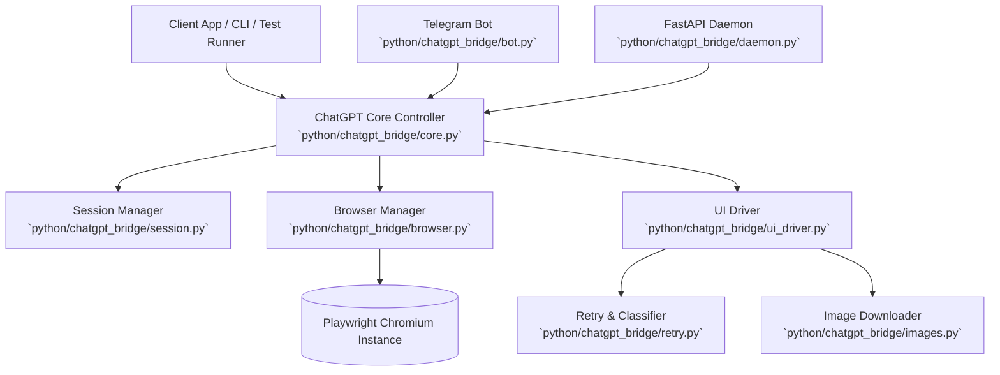
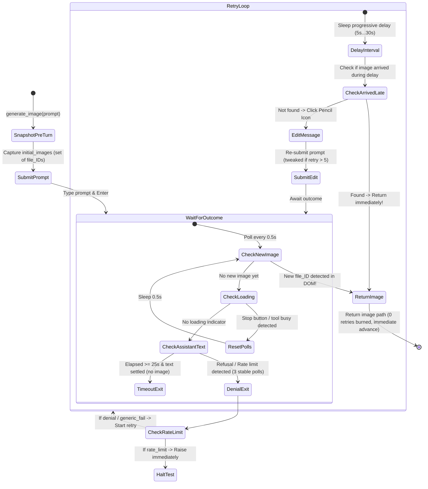

# Architecture & Technical Reference - ChatGPT Bridge

This document provides a comprehensive technical reference for the `chatgpt-bridge` architecture, detailing its component hierarchy, DOM driver mechanics, image generation lifecycle, retry state machine, and guidelines for future upgrades and modifications.

---

## 1. System Overview

`chatgpt-bridge` enables programmatic interaction with ChatGPT using your authenticated personal web session (free or Plus) without needing OpenAI API keys.



### Key Capabilities
- **Hybrid Path**: Fast HTTP API fallback for text queries; headful Playwright DOM automation for image generation and dynamic SPA features.
- **Strict Thread Continuity**: Ensures 100% same-conversation context across multiple sequential turns.
- **Pencil-Edit In-Place Retry**: Instead of spawning rogue chats or appending noisy retry messages, the driver clicks the pencil "Edit message" icon and re-submits in place.
- **Immediate Advance on Image Success**: Snapshots existing image IDs prior to generation; as soon as a new image renders in the DOM, execution immediately returns with zero redundant retries.
- **Rate Limit & Refusal Guard**: Distinguishes between real generation delays, safety refusals, and account rate limits.

---

## 2. Component Hierarchy

### 2.1 Core Controller (`python/chatgpt_bridge/core.py`)
- Entry point for library callers (`ChatGPT` class).
- Exposes async and sync methods: `ask`, `ask_sync`, `generate_image`, `generate_image_sync`, `delete_conversation`, `new_chat`.
- Maintains the active `conversation_id` pointer (`self._current_conversation_id`) so subsequent calls automatically maintain conversational continuity.

### 2.2 UI Driver (`python/chatgpt_bridge/ui_driver.py`)
- Directs Playwright page actions on `chatgpt.com`.
- Handles composer typing, prompt submission, stop button detection, and DOM traversal.
- Manages the lifecycle of message editing and outcome resolution.

### 2.3 Browser Manager (`python/chatgpt_bridge/browser.py`)
- Manages persistent browser context at `~/.chatgpt-bridge/profile`.
- Enforces single-window execution (`1920x1080`), prevents multi-tab confusion, and disables Chromium crash-restore popups (`--disable-session-crashed-bubble`).

### 2.4 Retry Engine (`python/chatgpt_bridge/retry.py`)
- Categorizes assistant text responses into:
  - `denial`: Policy/safety refusals.
  - `rate_limit`: Quota or temporary usage limits.
  - `deterministic`: Copyright / IP third-party match (non-retryable).
  - `generic_fail`: Temporary server errors.
  - `no_image`: Normal text answer without an image.
- Implements progressive retry interval timing:
  `5s, 10s, 15s, 20s, 25s, 26s, 27s, 28s, 29s, 30s` (up to 10 retries).

### 2.5 Telegram Bot (`python/chatgpt_bridge/bot.py`)
- Standalone long-polling bot supporting conversational text and `/image`.
- Converts ChatGPT Markdown to valid Telegram HTML, preserving fenced code blocks, language tags, and formatting.
- Safe chunking: splits long responses across 4096-character boundaries without breaking open HTML tags or code blocks.

---

## 3. Image Generation Lifecycle & State Machine

The image generation process in `UIDriver.generate_image()` follows a strict state machine designed to prevent premature timeouts and redundant retries:



### 3.1 Step 1: Pre-Turn Snapshotting
Before submitting any prompt, the driver queries all images currently in the DOM:
```python
initial_images = await self._existing_image_ids(page)
```
Each generated image carries an estuary file ID (e.g. `file_00000000761081f5b6df42c80a833d4d`) in its `src`. Keying on this ID guarantees uniqueness across turns.

### 3.2 Step 2: Real-Time Generation Detection (`_is_loading`)
ChatGPT does not render legacy loading testids. Active generation is detected via:
1. **Stop Buttons**:
   ```css
   button[data-testid="stop-button"], button[aria-label*="Stop"]
   ```
2. **Streaming / Tool Badges**:
   ```css
   .result-streaming, [aria-busy="true"], [data-testid*="dalle"], [data-testid*="tool"]
   ```
3. **Turn Text Badges**: Text matching `creating image|generating image|thinking...`.

While any indicator is active, `_is_loading` returns `True`, preventing premature timeouts while DALL-E processes (which takes 15–35 seconds).

### 3.3 Step 3: Immediate Return on Image Detection
On every 0.5s polling tick:
```python
src = await self._find_new_image_src(page, existing_ids)
if src:
    return {"kind": "image", "src": src}
```
If an image renders, the loop returns **immediately**. It never enters the retry loop or fires redundant pencil-edits.

### 3.4 Step 4: Pencil-Edit In-Place Retry (`_edit_message_retry`)
If an actual refusal (`"denial"`) or failure occurs:
1. Wait the progressive interval for this retry attempt (`5s, 10s, 15s...`).
2. Before clicking edit, check if an image from the previous attempt arrived during the sleep delay.
3. Target the pencil icon on the user's turn:
   ```css
   button[aria-label="Edit message"], [data-testid*="edit"]
   ```
4. If `retry_idx > 5` and a `tweaked_prompt` is provided, replace the text inside the edit textarea.
5. Click **Send** / **Save** or submit with Enter.

---

## 4. Conversation Continuity Protocol

1. **First Turn**:
   - `conversation_id=None`. Submits to `https://chatgpt.com/`.
   - Waits for the SPA route to update from `https://chatgpt.com/` to `https://chatgpt.com/c/<uuid>`.
   - Binds `self._current_conversation_id = <uuid>`.

2. **Subsequent Turns**:
   - Caller passes `conversation_id=<uuid>` (or uses core default).
   - Driver navigates directly to `https://chatgpt.com/c/<uuid>`, ensuring all message history and character context are visible to ChatGPT.
   - New turns append directly into the existing thread.

---

## 5. Maintenance & Upgrades Guide

### If OpenAI Changes Selectors
If ChatGPT updates its web UI DOM, update the constants in `python/chatgpt_bridge/ui_driver.py`:
- **Composer**: `COMPOSER_SELECTOR` (currently `[data-testid="composer-text-input"], div[contenteditable="true"]`).
- **Send Button**: `SEND_SELECTOR` (currently `[data-testid="composer-send-button"]`).
- **Stop Button**: Checked in `_is_loading()` via `button[data-testid="stop-button"], button[aria-label*="Stop"]`.
- **Edit Message**: Checked in `_edit_message_retry()` via `button[aria-label="Edit message"]`.
- **Images**: Defined in `python/chatgpt_bridge/images.py` (`IMAGE_SELECTOR`).

### Modifying Retry Intervals
Retry timing is configured in `python/chatgpt_bridge/retry.py`:
```python
DEFAULT_RETRY_INTERVALS = (5.0, 10.0, 15.0, 20.0, 25.0, 26.0, 27.0, 28.0, 29.0, 30.0)
```
Pass a custom `RetryConfig(max_tries=N, intervals=(...))` to customize attempts and backoffs per call.
