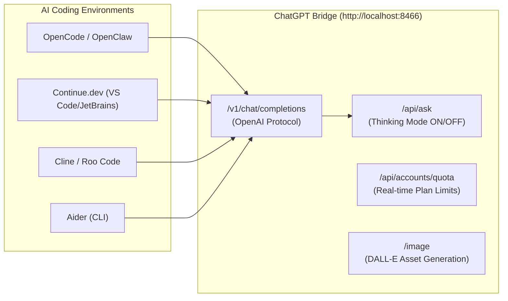

# 🔌 ChatGPT Bridge — IDE & External Project API Integration Guide

This guide explains how to connect external development environments (**OpenCode**, **OpenClaw**, **Continue.dev**, **Cline / Roo Code**, **Aider**, **Cursor**, or custom AI agents and scripts) directly to your self-hosted **ChatGPT Bridge**.

---

## ⚡ Overview & Architecture

ChatGPT Bridge runs locally as a headless browser automation gateway on port **`8466`**. It exposes two communication protocols:

1. **OpenAI-Compatible Drop-In API (`/v1`)**: Zero code changes required. Point any tool or SDK expecting `api.openai.com/v1` to `http://localhost:8466/v1`.
2. **Native High-Performance REST API (`/api`)**: Direct control over **Thinking Mode (Sol reasoning)**, multi-turn conversation memory, live account quotas, and DALL-E image generation.



---

## 🚀 1-Click IDE Configuration Presets

### 1. OpenCode & OpenClaw
OpenCode and OpenClaw connect directly via the OpenAI-compatible provider.

Add to your `opencode.json` or `openclaw_config.json`:
```json
{
  "provider": "openai-compatible",
  "api_base": "http://localhost:8466/v1",
  "api_key": "local-bridge",
  "models": [
    {
      "id": "chatgpt-thinking",
      "display_name": "ChatGPT 5.6 (Thinking Mode / Sol Reasoning)",
      "capabilities": ["code_generation", "refactoring", "deep_reasoning"],
      "thinking": true
    },
    {
      "id": "chatgpt",
      "display_name": "ChatGPT (Fast Completion)",
      "capabilities": ["docstrings", "quick_edits"],
      "thinking": false
    }
  ]
}
```

---

### 2. Continue.dev (VS Code & JetBrains)
In `~/.continue/config.json`:
```json
{
  "models": [
    {
      "title": "ChatGPT Thinking (Sol)",
      "provider": "openai",
      "model": "chatgpt-thinking",
      "apiBase": "http://localhost:8466/v1",
      "apiKey": "bridge"
    },
    {
      "title": "ChatGPT Fast",
      "provider": "openai",
      "model": "chatgpt",
      "apiBase": "http://localhost:8466/v1",
      "apiKey": "bridge"
    }
  ]
}
```

---

### 3. Aider (Terminal AI Pair Programmer)
Run Aider directly pointing to the bridge gateway:

```bash
# Deep Reasoning & Architecture Mode:
aider --openai-api-base http://127.0.0.1:8466/v1 \
      --openai-api-key none \
      --model chatgpt-thinking

# Fast Completion Mode:
aider --openai-api-base http://127.0.0.1:8466/v1 \
      --openai-api-key none \
      --model chatgpt
```

---

### 4. Cline / Roo Code (VS Code Extension)
1. Open **Cline Settings** -> select **API Provider**: `OpenAI Compatible`.
2. **Base URL**: `http://localhost:8466/v1`
3. **API Key**: `bridge` (or any dummy string).
4. **Model ID**:
   - Use `chatgpt-thinking` for complex multi-file refactoring and algorithm debugging.
   - Use `chatgpt` for rapid code completions.

---

## 🧠 Thinking Mode Control (Deep Reasoning vs. Fast Mode)

ChatGPT Bridge supports switching between deep reasoning (`gpt-5-6-t-mini` / Sol) and standard generation:

| Mode | Trigger in `/v1` | Trigger in `/api/ask` | Best Used For |
| :--- | :--- | :--- | :--- |
| **Thinking Mode** | `model: "chatgpt-thinking"` | `thinking: true` | Architectural refactoring, tricky bugs, race condition analysis, algorithm design. |
| **Fast Mode** | `model: "chatgpt"` | `thinking: false` | Inline completions, docstrings, unit test boilerplate, fast Q&A. |

---

## 💻 Code SDK Examples

### Python (`openai` SDK Drop-In)
```python
from openai import OpenAI

# Connect to local ChatGPT Bridge
client = OpenAI(
    base_url="http://localhost:8466/v1",
    api_key="local-bridge",
)

# Request reasoning output
response = client.chat.completions.create(
    model="chatgpt-thinking",  # Automatically triggers Thinking Mode
    messages=[
        {"role": "system", "content": "You are a principal engineer."},
        {"role": "user", "content": "Design an async task queue in Python with priority and cancellation."},
    ],
    stream=False,
)

print(response.choices[0].message.content)
```

---

### Node.js / TypeScript (`openai` SDK Drop-In)
```typescript
import OpenAI from 'openai';

const openai = new OpenAI({
  baseURL: 'http://localhost:8466/v1',
  apiKey: 'local-bridge',
});

async function main() {
  const completion = await openai.chat.completions.create({
    model: 'chatgpt-thinking',
    messages: [
      { role: 'system', content: 'You are a TypeScript expert.' },
      { role: 'user', content: 'Write a type-safe Event Emitter using TypeScript generics.' },
    ],
  });

  console.log(completion.choices[0].message.content);
}

main();
```

---

### Direct cURL (Native REST API)
```bash
# Chat with Thinking Mode Enabled
curl -X POST http://localhost:8466/api/ask \
  -H "Content-Type: application/json" \
  -d '{
    "prompt": "Explain raft consensus in 3 bullet points",
    "thinking": true,
    "conversation_id": "new"
  }'
```

---

## 📊 Real-Time Quota & Plan Limits API

Coding tools send rapid bursts of requests. Query the quota endpoint before long tasks to check headroom:

### `GET /api/accounts/quota`
```bash
curl -s http://localhost:8466/api/accounts/quota
```

**Response Example:**
```json
{
  "ok": true,
  "quota": {
    "account_id": "acc_1789300500",
    "alias": "Ajax1001",
    "email": "ajayreet1001@gmail.com",
    "plan_type": "go",
    "allowed": true,
    "limit_reached": false,
    "used_percent": 0.0,
    "reset_time": "2026-09-20T18:00:00Z"
  }
}
```

### Force Refresh Quota from Upstream:
```bash
curl -X POST http://localhost:8466/api/accounts/quota/refresh
```

---

## 🎨 Image Generation API (Diagrams & UI Mockups)

Generate DALL-E / GPT images from your editor or scripts:

### `POST /image`
```bash
curl -X POST http://localhost:8466/image \
  -H "Content-Type: application/json" \
  -d '{
    "prompt": "Isometric 3D software architecture diagram of microservices communicating over gRPC, dark minimalist style",
    "timeout_s": 180
  }'
```

**Response Example:**
```json
{
  "status": "success",
  "image_url": "http://localhost:8466/thumbnails/1789903777293.webp",
  "account_used": "Ajax1001",
  "conversation_id": "conv_uuid"
}
```

---

---

## ⚡ Concurrency Architecture (2 + 1 Slots)

The bridge runs an isolated **`2 + 1` concurrency engine**:
- **2 Parallel Chat Lanes**: Up to 2 coding environments or agents can submit chat prompts and stream responses simultaneously without waiting.
- **1 Dedicated Image Lane**: Heavy DALL-E image generation runs on an independent tab. Image generation never blocks chat, and chats never block image generation.
- **Anti-Ban Micro-Jitter**: The bridge automatically injects staggered pacing (450ms–650ms) across simultaneous submits to ensure web anti-bot heuristics are never triggered.

### 🛡️ Multi-Project / Client Isolation (`X-Client-ID`)
When connecting multiple tools (e.g., OpenCode and OpenClaw), pass a client identifier header:
```http
X-Client-ID: opencode
```
Or for another tool:
```http
X-Client-ID: openclaw
```
The bridge automatically isolates conversation memory per client, ensuring OpenCode's code refactors never contaminate OpenClaw's prompts.

---

## 🔄 Automatic Multi-Account Failover

Multi-account rotation is handled **100% automatically and internally** by the bridge:
1. When an active account approaches or hits an hourly rate limit, the bridge detects it.
2. It logs the rate-limit reset window.
3. It seamlessly rotates traffic to an authenticated backup account in the pool with zero downtime.

---

## 🩺 Health & Diagnostics Probes

- **Liveness probe:** `GET http://localhost:8466/health` ➔ `{"ok": true}`
- **System status probe:** `GET http://localhost:8466/status` ➔ Browser state, memory, and telemetry.
- **Interactive Developer Docs:** Navigate to `http://localhost:8466/docs` in your browser for the full interactive Scalar API sandbox.
- **Raw Markdown Spec for AI Agents:** `GET http://localhost:8466/api/docs/raw`
